# Fortuna (app.fortuna.cc) — UI / UX Review

**Scope:** logged-in session, desktop 1512×862, light + dark
**Pages I went through:** Events (home), Explore, Leaderboard, Tracking, Up/Down, Bonding, an Event detail, Filters modal, Columns modal, Settings popover

This is a report of bugs and findings. Everything below is an observation — take it as input, not as a list of asks.

---

## Contents

- [Bugs](#bugs)
  - [B1 — Custom volume filter eats "100K" / big numbers (event list)](#b1--custom-volume-filter-eats-100k--big-numbers-event-list)
  - [B2 — Minimum-volume filter has the same input bug](#b2--minimum-volume-filter-has-the-same-input-bug)
  - [B3 — Description panel scroll feels off on event detail](#b3--description-panel-scroll-feels-off-on-event-detail)
  - [B4 — Bonding has more columns offscreen and you can't tell](#b4--bonding-has-more-columns-offscreen-and-you-cant-tell)
  - [B5 — Trader detail "Share stats" → "Failed to generate image"](#b5--trader-detail-share-stats--failed-to-generate-image)
  - [B6 — Mobile: top nav doesn't scroll, hidden items unreachable](#b6--mobile-top-nav-doesnt-scroll-hidden-items-unreachable)
  - [B7 — Trade Feed header wraps weird (events page)](#b7--trade-feed-header-wraps-weird-events-page)
  - [B8 — Can't remove or edit a custom filter](#b8--cant-remove-or-edit-a-custom-filter)
  - [B9 — Trade Feed "hot" SELL rows are hard to read](#b9--trade-feed-hot-sell-rows-are-hard-to-read)
- [Findings](#findings)
  - [F1 — No command palette / no keyboard nav](#f1--no-command-palette--no-keyboard-nav)
  - [F2 — No auto-refresh control, no "last updated" anywhere](#f2--no-auto-refresh-control-no-last-updated-anywhere)
  - [F3 — No multi-column sort, sort doesn't stick](#f3--no-multi-column-sort-sort-doesnt-stick)
  - [F4 — Number columns aren't right-aligned, widths jump](#f4--number-columns-arent-right-aligned-widths-jump)
  - [F5 — You can't tell what filter / columns / sort is on](#f5--you-cant-tell-what-filter--columns--sort-is-on)
  - [F6 — Active nav state is soft](#f6--active-nav-state-is-soft)
  - [F7 — Clickable rows don't work with keyboard](#f7--clickable-rows-dont-work-with-keyboard)
  - [F8 — "Trade Now" is Telegram-only, no in-app fallback](#f8--trade-now-is-telegram-only-no-in-app-fallback)
  - [F9 — Track / Pin: weak state, no bulk action](#f9--track--pin-weak-state-no-bulk-action)
  - [F10 — Up/Down chart Y-axis labels cut off](#f10--updown-chart-y-axis-labels-cut-off)
  - [F11 — Event detail page hides its own title for ~3s while loading](#f11--event-detail-page-hides-its-own-title-for-3s-while-loading)
  - [F12 — No advanced search syntax in the search bar](#f12--no-advanced-search-syntax-in-the-search-bar)
  - [F13 — No saved column layouts, no saved filters](#f13--no-saved-column-layouts-no-saved-filters)
  - [F14 — No density / row-height toggle](#f14--no-density--row-height-toggle)
  - [F15 — No frozen first column when there are many columns](#f15--no-frozen-first-column-when-there-are-many-columns)
  - [F16 — Liquidity / spread / OI not shown on index pages](#f16--liquidity--spread--oi-not-shown-on-index-pages)
  - [F17 — Up/Down view has no hotkeys](#f17--updown-view-has-no-hotkeys)
  - [F18 — Up/down direction relies on color only sometimes](#f18--updown-direction-relies-on-color-only-sometimes)
  - [F19 — Right-rail trade feed cuts text with no "…"](#f19--right-rail-trade-feed-cuts-text-with-no-)
  - [F20 — Settings popover is almost empty](#f20--settings-popover-is-almost-empty)
  - [F21 — Position count is hard to find on trader detail](#f21--position-count-is-hard-to-find-on-trader-detail)
  - [F22 — No indexer health: indexed block vs chain head](#f22--no-indexer-health-indexed-block-vs-chain-head)
  - [F23 — Explore page shows duplicate "Hot Markets" cards](#f23--explore-page-shows-duplicate-hot-markets-cards)
  - [F24 — URL doesn't reflect filters / sort / page](#f24--url-doesnt-reflect-filters--sort--page)
  - [F25 — No cross-link from Leaderboard to Tracking](#f25--no-cross-link-from-leaderboard-to-tracking)
  - [F26 — Number abbreviations don't show the full number](#f26--number-abbreviations-dont-show-the-full-number)
  - [F27 — Empty state on `/tracking` doesn't tell you what to do next](#f27--empty-state-on-tracking-doesnt-tell-you-what-to-do-next)
  - [F28 — Document title is `Fortuna` on every route](#f28--document-title-is-fortuna-on-every-route)
  - [F29 — Heading hierarchy is partial](#f29--heading-hierarchy-is-partial)
  - [F30 — `color-scheme` on `<html>` and `<meta theme-color>` are missing](#f30--color-scheme-on-html-and-meta-theme-color-are-missing)
  - [F31 — `prefers-reduced-motion` is not respected](#f31--prefers-reduced-motion-is-not-respected)
  - [F32 — Pin button uses `title` only, no `aria-label`](#f32--pin-button-uses-title-only-no-aria-label)
  - [F33 — "Aggregating positions…" copy reads like an internal log line](#f33--aggregating-positions-copy-reads-like-an-internal-log-line)
- [Things that already work well](#things-that-already-work-well)
- [Evidence](#evidence)

---

## Bugs

### B1 — Custom volume filter eats "100K" / big numbers (event list)

**Where:** Events page → `Filters` → `Volume` → `Custom`.

**How to repro:** Type `100K` (or `100000`) into the custom volume input.

**What happens:** The input gets cleared and the preset `$100` chip becomes selected by itself. So you can't put `100K` as a custom value — it snaps to the small preset.

---

### B2 — Minimum-volume filter has the same input bug

**Where:** Events page → `Filters` → `Minimum volume`.

**What happens:** Same as B1. Typed values get rewritten to a preset chip. Big numbers can't go in.

---

### B3 — Description panel scroll feels off on event detail

**Where:** Event detail page → Description panel.

**Evidence:** [`attachments/event-description-scroll-bug.mov`](./attachments/event-description-scroll-bug.mov)

**What happens:** When you try to scroll inside the description, the scrolling goes to the wrong place — sometimes the page moves, sometimes the panel moves but in a weird way. See video for the actual behaviour.

---

### B4 — Bonding has more columns offscreen and you can't tell

**Where:** `/bonding` table.

**What happens:** There are more columns to the right that you can scroll to, but nothing tells you that. No shadow on the right edge, no scrollbar, no hint. So you don't know there's more data hiding.

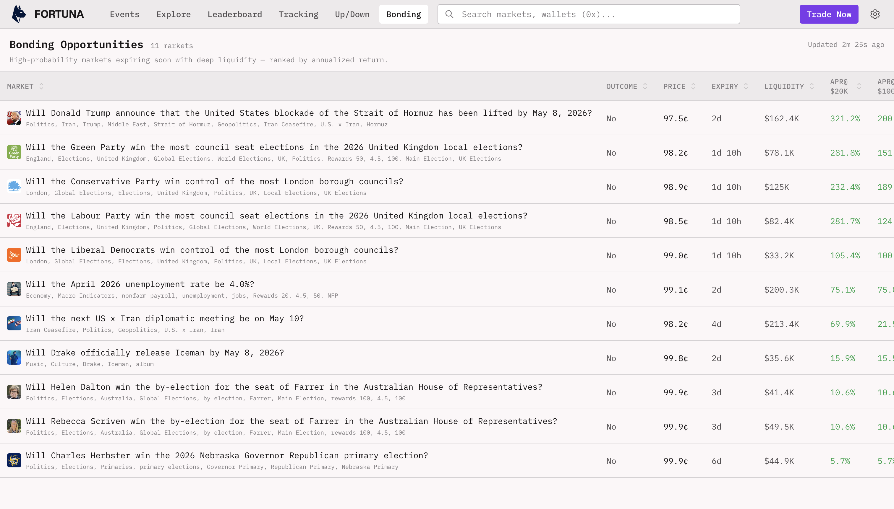

---

### B5 — Trader detail "Share stats" → "Failed to generate image"

**Where:** Trader detail page → click `Share stats`.

**Evidence:** 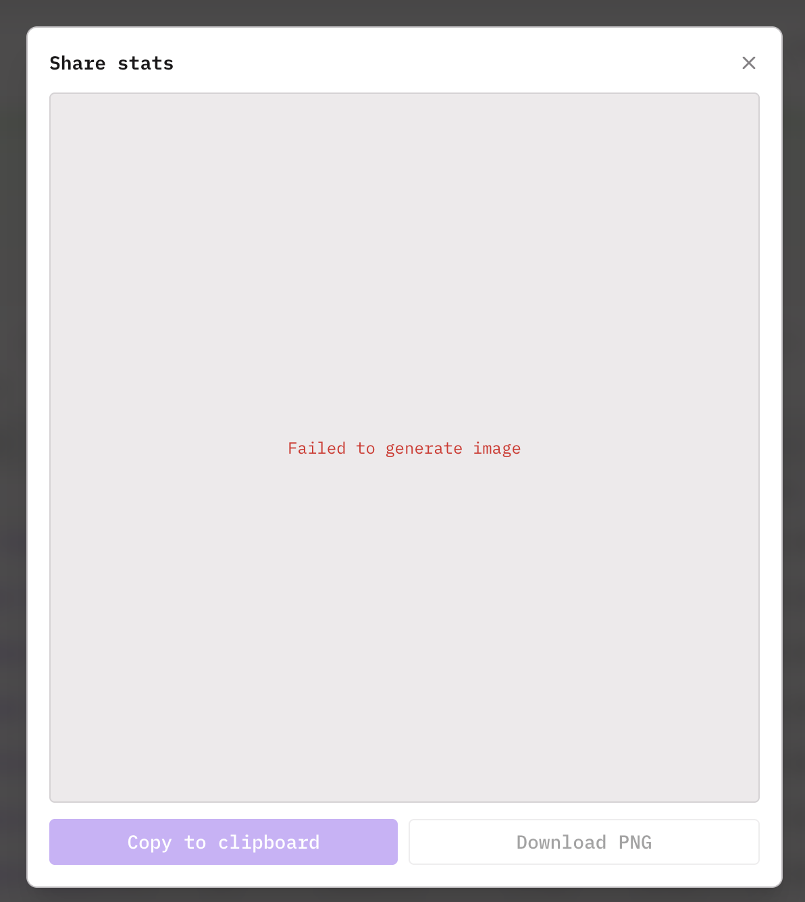

**What happens:** Modal opens, tries to make the share image, then shows `Failed to generate image` in red. `Copy to clipboard` button is still enabled (even though there is no image). `Download PNG` is disabled. So the feature doesn't work end-to-end.

---

### B6 — Mobile: top nav doesn't scroll, hidden items unreachable

**Where:** Mobile-size viewport (around 390–430px wide).

**Evidence:** [`attachments/mobile-nav-overflow-bug.mov`](./attachments/mobile-nav-overflow-bug.mov)

**What happens:** The top nav has 6 items (`Events / Explore / Leaderboard / Tracking / Up/Down / Bonding`). On a phone width they don't all fit. The ones that fall off the right are just gone — no horizontal scroll, no hamburger, no "more" button. So those pages are not reachable on phone. See video.

---

### B7 — Trade Feed header wraps weird (events page)

**Where:** Events page → right-rail Trade Feed → header row.

**What happens:** The header has a green dot, the title `Trade Feed`, the label `Min Size:`, and a chip `$100`. They all fight for room and the result looks broken: `Trade` and `Feed` on two lines on the left, `Min` and `Size:` on two lines in the middle, then `$100` on the right. Looks like a layout bug, not on purpose.

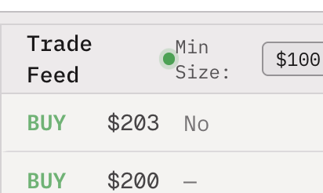

---

### B8 — Can't remove or edit a custom filter

**Where:** Events page → top filter row → `Custom +` (creates a custom filter).

**What happens:** Once you make a custom filter, there is no way to:

- delete it,
- rename it,
- edit the rules behind it,
- or even check what rules it has.

The chip just sits there. No `✕`, no right-click menu, no pencil icon, no entry in any "manage filters" place. So the feature is one-shot — make it once, can't iterate.

**Note:** The usage pattern for filters is try a slice → refine → throw it away. Without delete/edit, that loop doesn't close.

---

### B9 — Trade Feed "hot" SELL rows are hard to read

**Where:** Right-rail Trade Feed → the highlighted "hot" SELL rows.

**What happens:** These rows get a strong red gradient with a flame texture on top. White text on top of that flame is hard to read — the text fights against the bright/orange parts of the gradient and the texture adds a lot of visual noise. Whatever AA contrast there should be, it's not there in the bright middle of the gradient.

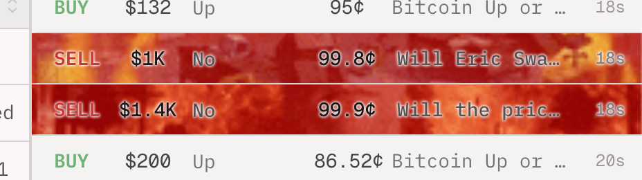

**Note:** These rows are meant to call attention to unusually big trades, so they're the ones a reader is most likely to want to parse at a glance.

---

## Findings

### F1 — No command palette / no keyboard nav

**What I see now:** To go between Events / Explore / Leaderboard / Tracking / Up/Down / Bonding, you have to use the mouse. There is no `Cmd/Ctrl+K`, no `g e` / `g l` style jumps, no `/` to focus search, no key to toggle theme.

**Note:** A heavy user switches pages a lot. Keyboard nav would remove a lot of mouse trips.

---

### F2 — No auto-refresh control, no "last updated" anywhere

**What I see now:** Prices, volumes, the trade feed — they all move on their own (live), but there is no `as of HH:MM:SS`, no pause button, no interval picker, nothing. If the websocket drops, you can't tell.

**Note:** Without a timestamp, there's no way to verify how fresh the screen is.

---

### F3 — No multi-column sort, sort doesn't stick

**What I see now:** Column headers (`Vol 5m`, `Vol 1h`, `5m`, `1h`, `Expiry`) look sortable but `shift+click` doesn't stack sorts, the sort indicator is a tiny chevron with no rank number, and the sort isn't in the URL.

**Note:** A sort like `Vol 24h DESC then 1h DESC` (hot today AND hot now) isn't expressible with single-column sort. And a sorted view can't be shared/bookmarked because the URL doesn't change.

---

### F4 — Number columns aren't right-aligned, widths jump

**What I see now:** A bunch of number columns on the home table (`Vol 5m`, `Vol 1h`, `Vol 24h`, `5m`, `1h`) are left-aligned. In the right-rail trade feed, the dollar amount sits left-aligned right next to text, also left-aligned.

**Note:** Reading down a left-aligned number column makes the eye re-anchor on every row, which loses magnitude-at-a-glance.

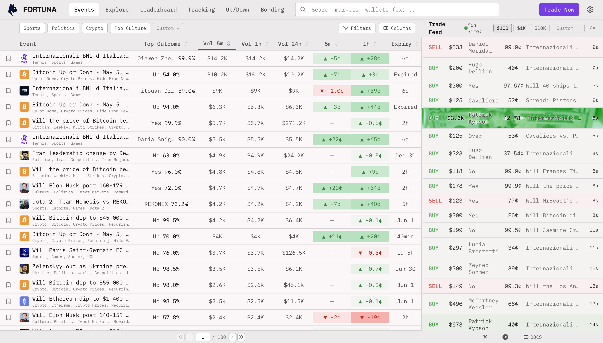

---

### F5 — You can't tell what filter / columns / sort is on

**What I see now:**

- The toolbar `Filters` and `Columns` buttons look the same whether 0 filters or 8 are applied.
- No badge, no count like `(9/12)`, no `aria-expanded`.
- The category chips (`Sports / Politics / Crypto / Pop Culture`) toggle, but there is no "applied filters" summary anywhere near the table.

**Note:** "I'm looking at the wrong slice and I don't know it" is a common filter-related confusion. The current UI doesn't surface what's on.

---

### F6 — Active nav state is soft

**What I see now:** The current page is shown only by a thin underline on the nav text. In a dense header that's easy to miss, especially when you're on a sub-route like `/updown/btc-5m`.

**Note:** "Where am I?" reads better when the active state is more visible.

---

### F7 — Clickable rows don't work with keyboard

**What I see now:** `div[role="row"].events-table__data-row--clickable` (22 on the home table, every leaderboard row, every bonding row) — they open the detail on mouse click. But pressing `Enter`/`Space` does nothing, and the rows are not in tab order.

**Note:** A keyboard-only user can't move down the table or open a row. The whole table view ends up mouse-only.

---

### F8 — "Trade Now" is Telegram-only, no in-app fallback

**What I see now:** The biggest button on every page sends you to `t.me/fortunatgbot`. There is no per-event "trade this market" button anywhere.

**Note:** When you're watching multiple markets, the action sits one hop away in a Telegram bot where you have to search the market again.

---

### F9 — Track / Pin: weak state, no bulk action

**What I see now:**

- The "Pin event" button on each row is a small empty checkbox icon with `title="Pin event"` only. No `aria-label`, no clear filled state when it's on.
- No bulk "track these wallets" action on the leaderboard.
- The Tracking page takes addresses one at a time. Bulk import is hidden behind `Import JSON` and there's no schema help or example.

**Note:** Pin/track are micro-actions used a lot, so visibility and bulk paths are worth thinking about.

---

### F10 — Up/Down chart Y-axis labels cut off

**What I see now:** The Y-axis says `904`, `804`, `704`. The real numbers are `$81,690.4`, `$81,680.4`, `$81,670.4`. The chart container is too narrow for the price.

**Note:** Glancing at it, you might read `904` and miss that it's `$81,690`.

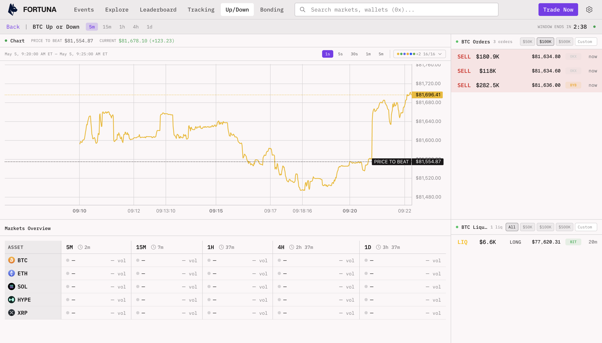

---

### F11 — Event detail page hides its own title for ~3s while loading

**What I see now:** Click an event row → go to `/event/<id>` → header is empty + `Aggregating positions…` for a few seconds while the orderbook and chart load. The event title and side are already known (you came from a row that had them), but they don't show up immediately.

**Note:** When opening many events one after another, an empty header makes you double-check what you opened.

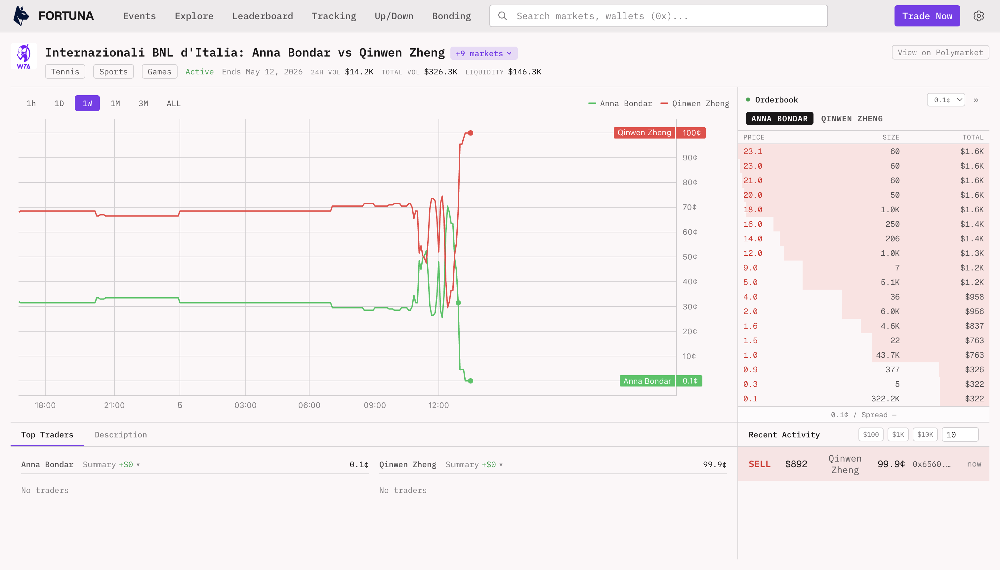

---

### F12 — No advanced search syntax in the search bar

**What I see now:** The header search just does substring match. No field syntax, no operators, no grouping by entity type.

**Note:** Structured search like `roi:>500%`, `vol24h:>100k`, `category:crypto` would replace several filter-modal + sort + scroll trips.

---

### F13 — No saved column layouts, no saved filters

**What I see now:** The `Columns` modal lets you turn columns on/off for the session. No "save layout", no "default layout", no import/export. Same for filters — no presets.

**Note:** Recurring views (e.g. "morning view", "wallet research view") get rebuilt every time, and there's no way to share a preset between accounts.

---

### F14 — No density / row-height toggle

**What I see now:** Row height is fixed. No compact mode, no wide mode, no inline-secondary-info mode.

**Note:** One row height has to compromise between fast-scan and deep-look reading.

---

### F15 — No frozen first column when there are many columns

**What I see now:** The Events table is ~14 viewports tall vertically and the header row sticks. But horizontally, no column is frozen.

**Note:** Once more columns are turned on, horizontal scroll loses the event name / outcome at the left.

---

### F16 — Liquidity / spread / OI not shown on index pages

**What I see now:** Bonding shows `Liquidity` and `APR%`. The home Events table shows volumes (`Vol 5m / 1h / 24h`) and price changes but no liquidity, no spread. The orderbook on event detail shows spread (`0.1¢ / Spread —`), but the index pages don't.

**Note:** Without liquidity/spread on an index page, you can't tell if a market is fillable from the list view.

---

### F17 — Up/Down view has no hotkeys

**What I see now:** Resolution (`5m / 15m / 1h / 4h / 1d`), time range, orderbook threshold (`$50K / $100K / $500K / All / Custom`), liquidations threshold, asset switcher (BTC / ETH / SOL / HYPE / XRP) — all mouse-only. No fullscreen-chart key. No "copy current state" link.

**Note:** Up/Down has the most controls per square inch, so it's the surface where keyboard control would save the most clicks.

---

### F18 — Up/down direction relies on color only sometimes

**What I see now:** `5m`, `1h`, `24h` change cells are red/green. Most rows have a `▲` / `▼` glyph too, but not all of them — in dark mode I saw `+0.x` rows where the only signal was the color.

**Note:** Color-only encoding can be hard to read for users with red/green color blindness, and small percentages are easy to misread fast. A glyph everywhere would make this consistent.

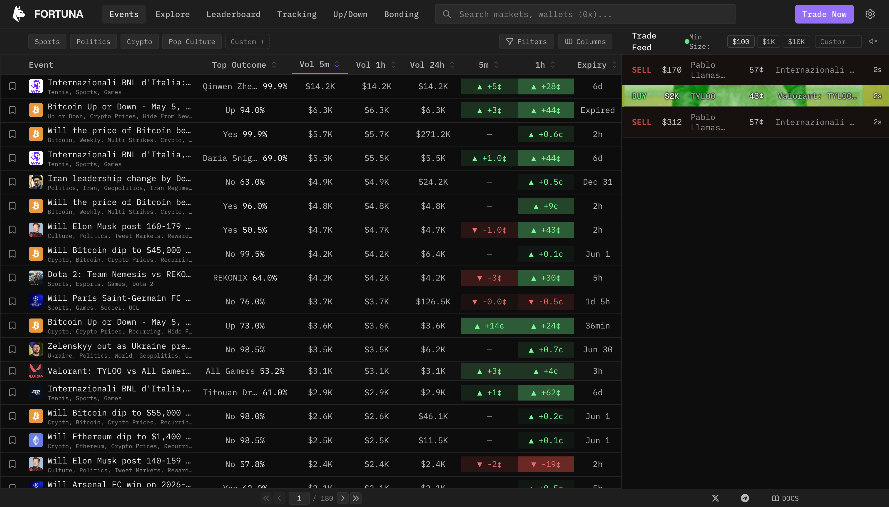

---

### F19 — Right-rail trade feed cuts text with no "…"

**What I see now:** Wallet names and event names in the right-rail trade feed get cut off mid-character. No `…` to mark it.

**Note:** Without an ellipsis, it's hard to tell where one event title ends and the next begins.

---

### F20 — Settings popover is almost empty

**What I see now:** The gear opens a small popover with only Light / Dark. No auto-refresh interval, no number format / timezone, no sound on big trades, no saved layouts, no connected wallet.

**Note:** The gear icon implies a settings page; the popover is currently just a theme toggle.

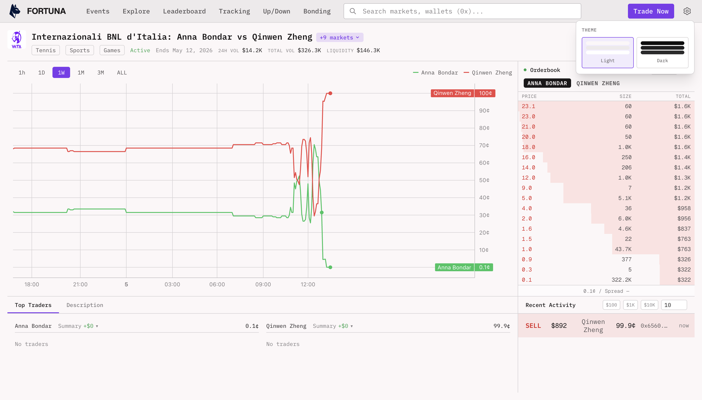

---

### F21 — Position count is hard to find on trader detail

**What I see now:** On the trader detail page, the Positions panel header looks like this: `Positions  Active / Closed                     Search...   11`. The count `11` lives over on the right, far from the word `Positions`, with the tab control and a wide search field in between.

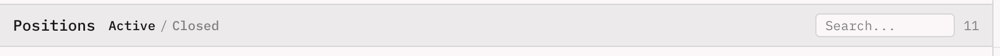

**Note:** "How many open positions does this wallet have?" reads more easily when the count sits next to the label.

---

### F22 — No indexer health: indexed block vs chain head

**What I see now:** Nothing in the UI tells you how fresh the on-chain data is. The trade feed and prices animate, but you can't tell:

- if the indexer is caught up to the chain head,
- by how many blocks / seconds it's behind,
- if it's healthy, or if the websocket dropped silently.

This is close to F2 (auto-refresh) but not the same — F2 is about the UI refreshing, this is about the backend pipeline lag. The UI can refresh fine and the indexer can still be behind.

**Note:** Without a freshness signal, there's no way to know if "live" data is actually live.

---

### F23 — Explore page shows duplicate "Hot Markets" cards

The same MLB matchups (Diamondbacks vs Brewers, Tigers vs Braves, …) show up twice in the first 8 cards.

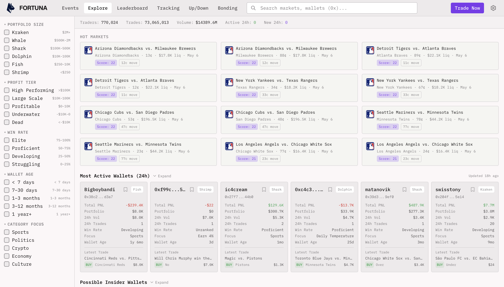

---

### F24 — URL doesn't reflect filters / sort / page

You can't bookmark "Crypto, sorted by Vol24h, page 3" because the URL never changes. No filter / sort / pagination in the URL.

---

### F25 — No cross-link from Leaderboard to Tracking

On `/leaderboard` there's no "Track this wallet" button per row. Wallets you want from there have to be copied and pasted into `/tracking`.

---

### F26 — Number abbreviations don't show the full number

`$14.2K`, `$326.3K`, `$146.3K` save space but there's no hover / `title` showing the precise number.

---

### F27 — Empty state on `/tracking` doesn't tell you what to do next

It says: *"Add wallet addresses in the left panel to see their live trades"*. No primary `Add wallet` button, no link to `/leaderboard` as a starting point.

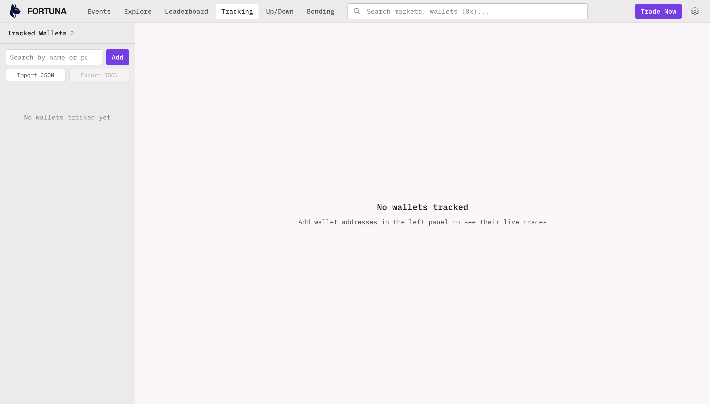

---

### F28 — Document title is `Fortuna` on every route

Hard to tell tabs apart when you have 6+ open.

---

### F29 — Heading hierarchy is partial

`/bonding` has an `h1`, others don't.

---

### F30 — `color-scheme` on `<html>` and `<meta theme-color>` are missing

Affects mobile browser chrome and native form controls in dark mode.

---

### F31 — `prefers-reduced-motion` is not respected

Animations play regardless of the OS setting.

---

### F32 — Pin button uses `title` only, no `aria-label`

Screen reader users get no accessible name for the action.

---

### F33 — "Aggregating positions…" copy reads like an internal log line

The phrasing is more "engineering log" than "user message".

---

## Things that already work well

- **Bloomberg-terminal feel.** Monospace font + tight rows + sparkline columns + live trade feed gives a recognisable trading vibe.
- **Real dark mode**, not a quick patch. Charts, sidebars, table contrast all hold up.
- **Semantic table roles** (`role="table" / row / columnheader / cell`). With keyboard handlers added (F7) this is a strong base.
- **Pagination is explicit.** `1 / 15401` on the leaderboard is a small but nice touch.
- **External link to Polymarket** on event detail — useful for cross-checking.
- **The live trade feed** is a strong feature on the surface.
- **Trade Now opens in a new tab** with `rel="noopener noreferrer"` — good baseline.

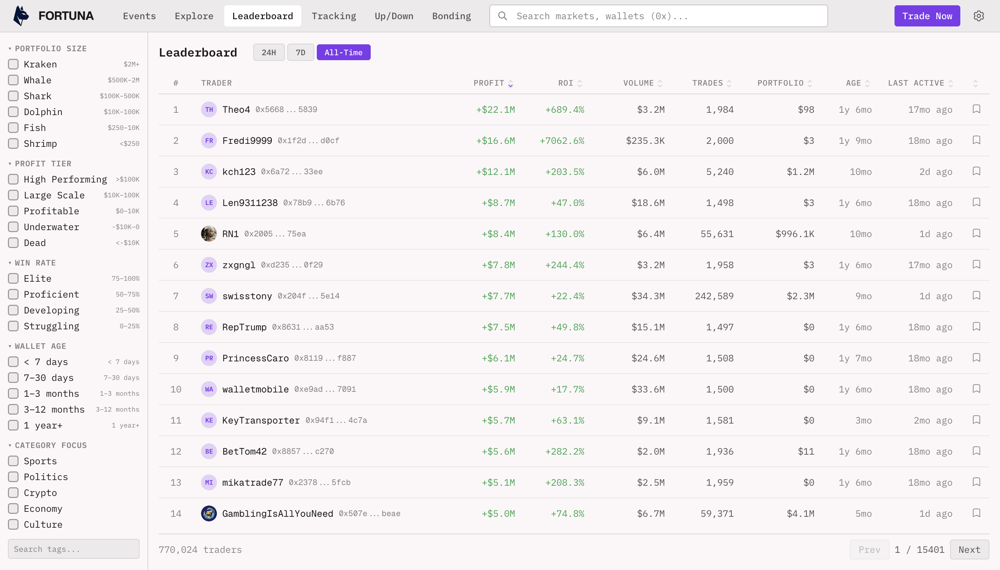

---

## Evidence

### Screenshots

| File | Page / context |
|---|---|
| `screenshots/01-home.png` | Events (light) |
| `screenshots/02-explore.png` | Explore |
| `screenshots/03-leaderboard.png` | Leaderboard |
| `screenshots/04-tracking.png` | Tracking (empty state) |
| `screenshots/05-updown.png` | Up/Down |
| `screenshots/06-bonding.png` | Bonding |
| `screenshots/07-event-detail.png` | Event detail (loading skeleton) |
| `screenshots/08-settings.png` | Settings popover |
| `screenshots/09-home-dark.png` | Events (dark) |
| `screenshots/11-trader-share-stats-failed.png` | Trader detail — Share stats failure |
| `screenshots/12-positions-tabs.png` | Trader detail — Positions header |
| `screenshots/13-trade-feed-header-wrap.png` | Trade Feed header wrap (events page) |
| `screenshots/14-trade-feed-sell-fire-row.png` | Trade Feed "hot" SELL row contrast |

### Attachments

| File | Page / context |
|---|---|
| `attachments/event-description-scroll-bug.mov` | B3 — event-detail description scroll bug |
| `attachments/mobile-nav-overflow-bug.mov` | B6 — mobile top-nav overflow, items unreachable |
